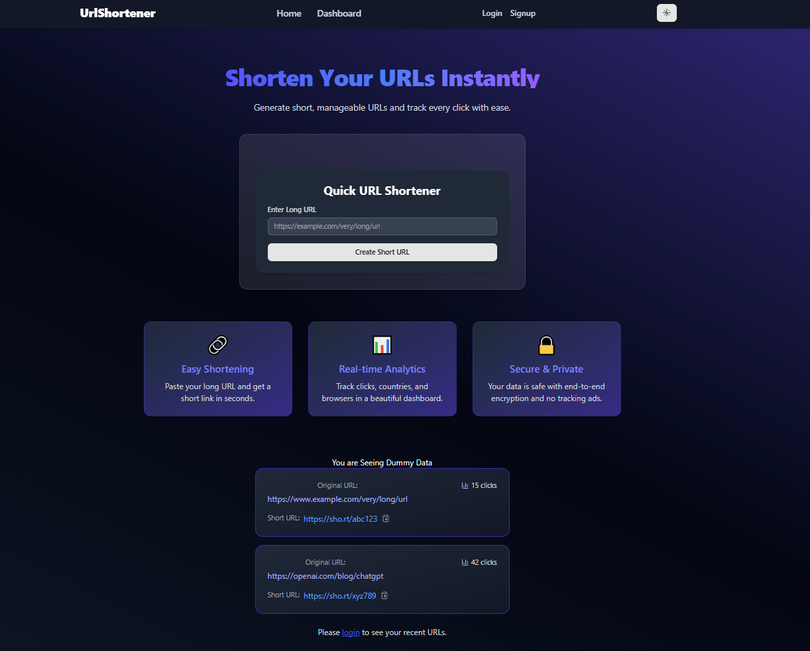

# 🌐 Full Stack URL Shortener

A production-ready URL shortener application with analytics, authentication, and a modern UI — built with **React**, **TypeScript**, **Redux Toolkit**, **Tailwind CSS** (Frontend) and **Node.js**, **Express**, **MongoDB**, **JWT** (Backend).

---

## 🚀 Features

- 🔗 URL shortening with unique IDs
- 🧑‍💻 Secure user authentication (JWT-based)
- 📊 Analytics dashboard with charts (browser, OS, device, clicks)
- 🎨 Light & Dark mode toggle
- 🧠 Form validation with Zod + React Hook Form
- 💬 Toast notifications for feedback
- 📱 Fully responsive UI

## 🔮 Future Enhancements

- QR code generation for shortened links
- URL expiration & password protection
- Admin dashboard for managing URLs
- Improved analytics with charts over time

## 🚀 Deployed On

- **Frontend**: [Vercel Deployment](https://url-shortener-three-navy.vercel.app/)
- **Backend**: [Render API](https://urlshortener-fc5z.onrender.com)

